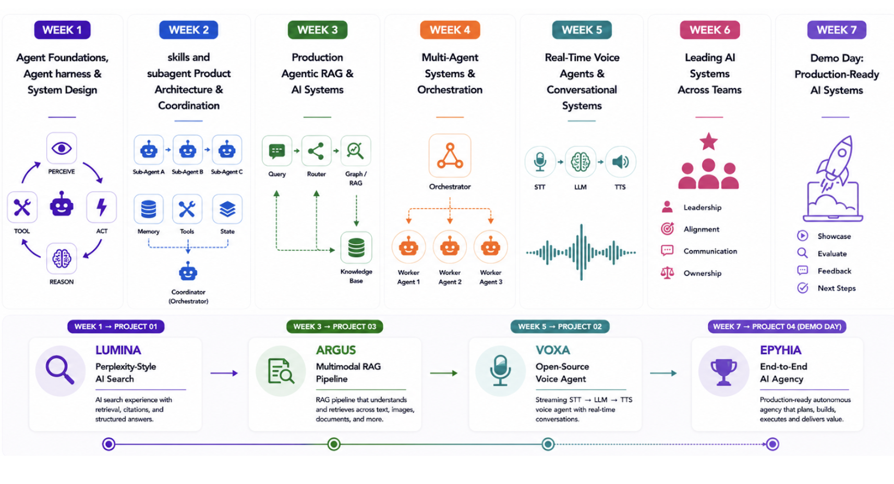
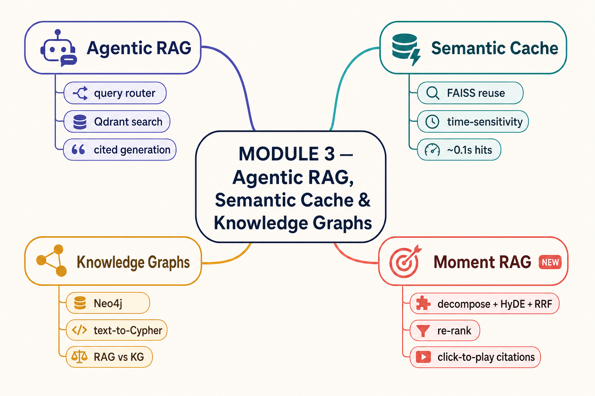

<div align="center">

# 🤖 FDE Agent Engineering Bootcamp
### Agent Engineering + Forward Deployed Engineering, merged

**From a 50-line agent loop to a production-ready AI agency — seven weeks, four shipped products, built by you.**

[](https://maven.com/boring-bot/advanced-llm)
&nbsp;
[](https://maven.com/boring-bot/ai-system-design)
&nbsp;

&nbsp;
[](https://claude.com/claude-code)

[**Agent Engineering Bootcamp**](https://maven.com/boring-bot/advanced-llm) · [**FDE Bootcamp**](https://maven.com/boring-bot/ai-system-design) · [**Curriculum**](#course-curriculum) · [**The four projects**](#the-four-projects) · [**What you'll build**](#what-youll-build) · [**Learn with Claude**](#learn-with-claude-ai-tutor)



**Cohort 2026-03 · Aug 31 – Oct 11, 2026 · 6 live sessions · 6 office hours · 1 demo day · 20+ hours**

</div>

---

Welcome to the official course repository for the **FDE Agent Engineering Bootcamp** — all the code, notebooks, exercises, and project specs used throughout the course. This cohort merges two Maven courses that used to run separately:

- [**Agent Engineering Bootcamp: Developers Edition**](https://maven.com/boring-bot/advanced-llm) (★ 4.8, 132 reviews) — the loop, the harness, agentic RAG, multi-agent coordination, voice; *"master the full agent stack from first principles to production."*
- [**Forward Deployed Engineering Bootcamp**](https://maven.com/boring-bot/ai-system-design) (★ 4.9, 54 reviews) — *"build full-stack AI products, from MVP to deployment"*: React frontend, Node backend, hosted models, four real deployments.

Six modules teach the concepts; four projects make you ship them.

> **Looking for a previous cohort?** The prior version of this course is preserved on the [`2026-02`](https://github.com/hamzafarooq/multi-agent-course/tree/2026-02) branch (and `2026-01` before it).

## Why merge Agent Engineering and FDE?

Modern AI builders need more than model skills.

- **Roles are converging.** AI work now requires system design and production skills, not just prompts.
- **FDEs need AI depth.** Agents, RAG, voice, and orchestration are becoming the core of the job.
- **The model is only one piece.** Reliability, latency, cost, security, and scale decide whether it ships.
- **Industry needs end-to-end builders** who can understand the problem, design, build, and ship.

## By the end of this bootcamp you will be able to

- Master **loop engineering** for reliable AI agents.
- Build **agent harnesses** with tools, state, memory, and observability.
- Apply **system and product design** across frontend, backend, APIs, data, and deployment.
- Engineer **production Agentic RAG** with retrieval, knowledge graphs, and caching.
- Design **multi-agent systems** with sub-agents, orchestration, MCP, and A2A.
- Build **scalable AI systems** for performance, reliability, and cost.
- Create **real-time voice agents** optimized for streaming and low latency.
- Make **architecture trade-offs** across performance, cost, security, reliability, and scale.

## Who this course is for

- **AI / ML engineers** ready to move from prototypes to production.
- **Software / full-stack engineers** building AI-native products and agents.
- **Forward deployed / solutions engineers** solving customer problems with AI.
- **Engineering & product leaders** making better architecture and scaling decisions.
- **Builders** who want to understand the complete system around AI.

## Quick Links

**Course modules** (in teaching order):

1. [Week 1 — Agent Foundations, Agent Harness & System Design](#week-1--agent-foundations-agent-harness--system-design)
2. [Week 2 — Skills & Subagents: Product Architecture & Coordination](#week-2--skills--subagents-product-architecture--coordination)
3. [Week 3 — Production Agentic RAG & AI Systems](#week-3--production-agentic-rag--ai-systems)
4. [Week 4 — Multi-Agent Systems & Orchestration](#week-4--multi-agent-systems--orchestration)
5. [Week 5 — Real-Time Voice Agents & Conversational Systems](#week-5--real-time-voice-agents--conversational-systems)
6. [Week 6 — Leading AI Systems Across Teams](#week-6--leading-ai-systems-across-teams)
7. [Week 7 — Demo Day: Production-Ready AI Systems](#week-7--demo-day-production-ready-ai-systems)

**Also on this page:** [The four projects](#the-four-projects) · [How to use this repo](#how-to-use-this-repo) · [What you'll build](#what-youll-build) · [Sprint Zero](#full-stack-projects)

### 🗺️ Course at a glance

| Week | Module | The big idea | You ship |
|---|--------|--------------|----------|
| 1️⃣ | **Agent Foundations, Agent Harness & System Design** | What an agent *actually* is, and what a system around it looks like | A ReAct agent from scratch · **LUMINA** kicks off |
| 2️⃣ | **Skills & Subagents: Product Architecture & Coordination** | One agent → a coordinated product built by specialized subagents | **Sprint Zero** — a multi-agent app builder |
| 3️⃣ | **Production Agentic RAG & AI Systems** | Retrieval as a decision the agent makes, evaluated and guarded | A cited video-moment RAG + eval harness · **ARGUS** kicks off |
| 4️⃣ | **Multi-Agent Systems & Orchestration** | When many agents beat one, and the protocols (MCP · A2A · ADK) that make it work | A coordinated multi-agent support system |
| 5️⃣ | **Real-Time Voice Agents & Conversational Systems** | STT → LLM → TTS under a latency budget, two architectures head-to-head | A benchmarked voice agent · **VOXA** kicks off |
| 6️⃣ | **Leading AI Systems Across Teams** | From building the system to leading the people and decisions around it | An AI roadmap + measurement plan for a real team |
| 7️⃣ | **Demo Day** | Show it, measure it, defend it | **EPYHIA** — an end-to-end AI agency, live |

---

## The Four Projects

Concepts are taught in the modules; the projects are where you ship. Each is a real product built end to end — frontend, agent logic, model serving, caching, deployment — and graded against a **measurable rubric plus a short video demo, not vibes**. LUMINA's PRD ships inside Module 1; the other three specs, rubrics, and evaluators live in the [previous cohort's FDE assignments](FDE-01-assignments/README.md) until their 2026-03 versions land in their module folders.

| Starts | Project | You build | Spec |
|---|---|---|---|
| Week 1 | 🔍 **LUMINA** — Perplexity-style AI search | An AI search experience with retrieval, citations, and structured answers | [PRD](modules/Module_1_Agent_Foundations_Harness_System_Design/Assignment_1_Lumina/PRD.md) |
| Week 3 | 📄 **ARGUS** — Multimodal RAG pipeline | A RAG pipeline that understands and retrieves across text, images, documents, and more — with cited moments | [Assignment 3 — Moment Search at Scale](FDE-01-assignments/Assignment_3_Moment_Search_Scaled/) |
| Week 5 | 🎙️ **VOXA** — Open-source voice agent | A streaming STT → LLM → TTS voice agent that holds a real-time conversation | [Assignment 2 — Voice Agent](FDE-01-assignments/Assignment_2_voice_agent/) |
| Week 7 | 🏆 **EPYHIA** — End-to-end AI agency (Demo Day) | A production-ready autonomous agency that plans, builds, executes, and delivers value | [Assignment 4 — EPYHIA](FDE-01-assignments/Assignment_4_Final_Epyhia/) |

Every project ships an `eval/` folder with a `rubric.json` and an `eval.py` that scores your running deployment, captures evidence, and produces a **Product Evaluation** report you submit with a 60–90s demo. [See a sample scorecard →](FDE-01-assignments/Assignment_1_Live_Translate/README.md#sample-scorecard)

---

## How to Use This Repo

- Content is organized **module by module** under `modules/`, aligned with the live sessions and project milestones. Project specs live under `FDE-01-assignments/`.
- **Google Colab Pro** is the preferred environment for the notebooks. You can also **clone locally** and run them in Jupyter or your IDE.
- Most notebooks include their own dependencies via `!pip install`; where a module needs more, a `requirements.txt` sits alongside it.

### Learn with Claude (AI tutor)

This repo is also set up to be **read and used with [Claude](https://claude.com/claude-code)** as a personal tutor. Drop the folder into Claude Code (or upload it to Claude.ai) and Claude reads `CLAUDE.md` to act as a patient, interactive guide through the course — teaching one concept at a time, checking your understanding, and tracking your progress in `progress/learner-progress.md`.

**Get started:** open the folder in Claude Code and type `/start`, or paste *"Read CLAUDE.md and run the `/start` onboarding"* into Claude.ai. Claude will greet you, ask how you like to learn, and begin Module 1.

**Slash commands**

- `/start` — onboard: pick a learning style and begin Module 1 (or the next one)
- `/progress` — see where you are, what's next, and any flagged weak spots

**Skills Claude auto-invokes** (in `.claude/skills/`) — just ask in plain language:

| Skill | What it does | Try saying |
|-------|--------------|------------|
| `teach-module` | Runs an interactive lesson for a module, one concept at a time | *"Teach me module 3"* |
| `quiz-me` | Quizzes you and tracks weak spots (never reveals answers first) | *"Quiz me on RAG"* |
| `explain-eli5` | Re-explains a concept as simply as possible, with analogies | *"Explain isolated context like I'm five"* |
| `build-along` | Guides you through a hands-on exercise step by step | *"Let's do the build-along for module 1"* |
| `warmup` | A ~15-min pre-class refresher: recaps the last module, previews the next | *"I have class soon — warm me up for module 2"* |

### Clone locally (optional)

```bash
git clone https://github.com/hamzafarooq/multi-agent-course.git
cd multi-agent-course
python3 -m venv .venv
source .venv/bin/activate
```

### Clone via Claude Code chat

You can clone this repo directly from the Claude Code chat interface without leaving your conversation:

1. Open [Claude Code](https://claude.ai/code) in your browser (or launch `claude` in your terminal)
2. In the chat, type:
   ```
   Clone https://github.com/hamzafarooq/multi-agent-course.git and open it
   ```
3. Claude will clone the repo into a directory of your choice, set up the project, and open it — ready for you to start learning.

From there, type `/start` to begin the AI-guided onboarding.

### Recommended resource

To go deeper on building LLM applications, see the book
[**Build LLM Applications from Scratch**](https://www.manning.com/books/build-llm-applications-from-scratch).

---

## Course Curriculum

> Six modules across six weeks, one 2-hour live session and one office hour each, then Demo Day in week seven. Every week ends with a working artifact you built yourself, and four of those weeks kick off a shipped product.

### Week 1 — Agent Foundations, Agent Harness & System Design

Demystify what an agent actually is — the perceive → reason → act loop and the **ReAct** pattern — then zoom out to the *system* around it: the harness, the components, where state lives, and how the whole thing scales. Build a ReAct agent from scratch, no framework.

**What this module covers:** agent & system foundations (software → ML → AI) · the agentic loop & the agent harness · components & responsibilities · state, communication & trade-offs · scale up vs. scale out

**Key topics:** the agent loop · ReAct (Reasoning + Acting) · agent vs. workflow vs. chatbot · debugging via the trace · agent frameworks (smolagents) · vertical vs. horizontal scaling for AI systems

**🚀 Project kickoff: LUMINA** — a Perplexity-style AI search experience. Week 1 gives you the loop; the project makes you wrap it in retrieval, citations, and a real frontend.
[Read the PRD →](modules/Module_1_Agent_Foundations_Harness_System_Design/Assignment_1_Lumina/PRD.md)

**🔎 Reference app: Alex** — a finished Perplexity-style assistant you can clone and take apart before you build LUMINA. Four levels (LLM → chatbot → tool-using agent → RAG assistant), a debug panel that shows the exact API request behind every answer, and a keyword-vs-semantic Search Lab. Hosted at https://lumina-perplexity-clone.vercel.app (password shared in class).
[Open Alex →](modules/Module_1_Agent_Foundations_Harness_System_Design/Alex_Perplexity_Clone/README.md)

[Open Module 1 →](modules/Module_1_Agent_Foundations_Harness_System_Design/README.md)

---

### Week 2 — Skills & Subagents: Product Architecture & Coordination

Go from *one* agent doing one thing well to a *coordinated product* built by specialized subagents. Learn why isolated context windows are the whole point, the orchestrator + subagents pattern, how to define your own subagents and skills — then watch the pattern run end to end in **Sprint Zero**.

**What this module covers:** multi-agent architectures (Supervisor, Plan-and-Execute, …) · sub-agents & coordination · tools, skills & MCP · memory in multi-agent systems · governance, security & guardrails

**Key topics:** agents vs. subagents · isolated context windows · the orchestrator pattern (sequential vs. parallel) · defining subagents in `.claude/agents/` · specialization & the shared-spec coordination layer · multi-agent failure modes

**📦 Featured project: [Sprint Zero](#sprint-zero--a-multi-agent-product-team-in-your-terminal)** — the module's capstone: a multi-agent system that turns a product URL and three answers into six spec docs and a working full-stack app.

[Open Module 2 →](modules/Module_2_Skills_Subagents_Product_Architecture/README.md)

---

### Week 3 — Production Agentic RAG & AI Systems

Treat retrieval as a tool the agent *decides* to use — not a static bolt-on. Add a semantic cache for real latency/cost wins, contrast vector RAG with Knowledge Graphs, push retrieval down to the exact *moment* in a video, then **prove it works** with the right metrics and guard it for production.

**What this module covers:** production agentic RAG · advanced RAG techniques (re-ranking, query transformation, hybrid search) · RAG evaluation & optimization · security, safety & guardrails · productionization & scaling

**Key topics:** naive vs. agentic RAG · query routing & multi-hop retrieval · query decomposition + HyDE · hybrid retrieval & RRF fusion · cross-encoder re-ranking · semantic caching · Knowledge Graphs & text-to-Cypher · moment-level video RAG · the eval pyramid (LLM → RAG → agent metrics) · guardrails (Llama Guard)

> 🗺️ **New here?** [Module 3 at a glance](modules/Module_3_Production_Agentic_RAG_AI_Systems/README.md#module-3-at-a-glance) — a one-screen map of the five folders below.



**🎬 Featured project: Moment RAG** — agentic RAG on *video*. Ask a complex question and get a streamed, **cited** answer where every citation pops up the source YouTube episode at the **exact moment**, with a synced transcript. Pipeline: self-query → decompose → hybrid retrieve (dense + BM25 + HyDE questions, RRF) → cross-encoder re-rank → cited synthesis.
[View documentation →](modules/Module_3_Production_Agentic_RAG_AI_Systems/Moment_RAG/README.md)

```bash
cd modules/Module_3_Production_Agentic_RAG_AI_Systems/Moment_RAG
pip install -r requirements.txt
cp .env.example .env      # add OPENAI_API_KEY
uvicorn app:app --reload  # open http://localhost:8000
```

**📊 Featured project: RAG vs. Knowledge Graph comparison framework** — a Streamlit app that objectively compares RAG and KG approaches with LLM-based evaluation and interactive graph visualizations.
[View documentation →](modules/Module_3_Production_Agentic_RAG_AI_Systems/Knowledge_Graphs/README.md)

```bash
cd modules/Module_3_Production_Agentic_RAG_AI_Systems/Knowledge_Graphs
python setup.py      # one-time setup
streamlit run app.py
```

**📏 Featured notebook: AI Evaluation Metrics** — a plain-English tour of the metrics used across every layer of an AI system: LLM quality & reasoning, RAG retrieval & generation, and full agent/multi-agent evaluation. No API keys, no model downloads — just the standard library doing the arithmetic so you can watch the numbers move.
[View documentation →](modules/Module_3_Production_Agentic_RAG_AI_Systems/Evaluation_and_Guardrails/README.md) · [](https://colab.research.google.com/github/hamzafarooq/multi-agent-course/blob/main/modules/Module_3_Production_Agentic_RAG_AI_Systems/Evaluation_and_Guardrails/AI_Eval_Metrics.ipynb)

**🚀 Project kickoff: ARGUS** — a multimodal RAG pipeline. Take Moment RAG's cited-moment retrieval and scale it across text, images, documents, and slides through an async ingestion queue.

[Open Module 3 →](modules/Module_3_Production_Agentic_RAG_AI_Systems/README.md)

---

### Week 4 — Multi-Agent Systems & Orchestration

When many agents beat one — and the more common case where they don't. Build a coordinated multi-agent system, learn the protocol layer underneath the marketing, and instrument it so you can debug it.

**What this module covers:** sub-agent & multi-agent foundations · coordination strategies & orchestration · agent-to-agent (A2A) communication & protocols · shared state, memory & context management · observability, evaluation & debugging

**Key topics:** one agent vs. many · topologies (orchestrator-worker, hierarchical, swarm, handoff) · **MCP** (tools), **A2A** (agent-to-agent), **ADK** (Google's framework) · shared memory & message passing · tracing multi-agent runs

> 🗺️ **New here?** [Module 4 overview](modules/Module_4_Multi_Agent_Systems_Orchestration/README.md) — how MCP, A2A, and ADK compose into one running system.

**🛎️ Featured project: Advanced Customer Support Agent** — a CLI support agent that ties all three protocols together: **ADK** defines the agents (Gemini 2.5 Flash), **A2A** runs the Security Judge and PII Masker as independent microservices, and **MCP Toolbox** exposes a PostgreSQL backend as tools. Wrapped in a multi-layer security pipeline (input sanitization → A2A security judge → DLP-based PII masking).
[View documentation →](modules/Module_4_Multi_Agent_Systems_Orchestration/advance-customer-support-agent-feature-A2A-MCP-ADK/README.md)

```bash
cd modules/Module_4_Multi_Agent_Systems_Orchestration/advance-customer-support-agent-feature-A2A-MCP-ADK
pip install -r requirements.txt
cp .env.example .env      # add Google Cloud + Mem0 keys
python -m cs_agent.a2a.run_servers   # start the A2A servers, then run the CLI
```

[Open Module 4 →](modules/Module_4_Multi_Agent_Systems_Orchestration/README.md)

---

### Week 5 — Real-Time Voice Agents & Conversational Systems

Ship an agent that talks — and survives real conversation — then benchmark two different architectures for doing it head-to-head.

**What this module covers:** real-time voice agents & conversational systems · voice, STT, LLM & TTS foundations · system design, guardrails & performance optimization · evaluation, monitoring & quality assurance · deployment, integration & best practices

**Key topics:** the voice stack (STT → LLM → TTS) · turn-taking & end-of-turn detection · latency budgeting, streaming & barge-in · tool calling inside a voice loop · provider landscape (Deepgram, ElevenLabs, OpenAI Realtime, Vapi, Retell) · cascade vs. speech-to-speech architectures · benchmarking voice agents on cost, latency, and capability

**🚀 Project kickoff: VOXA** — an open-source voice agent. Streaming STT → LLM → TTS with a knowledge router, evals, and telemetry, holding a real-time conversation.

[Open Module 5 →](modules/Module_5_Voice_Agents_Conversational_Systems/README.md)

---

### Week 6 — Leading AI Systems Across Teams

You can build the system. Now lead the people and decisions around it: set the strategy, drive adoption, govern responsibly, and measure whether any of it moved the business.

**What this module covers:** leadership & team alignment · AI strategy & roadmapping · organizational change & adoption · AI ethics, governance & compliance · measuring impact & ROI

**Key topics:** aligning teams on shared goals · prioritizing use cases into a roadmap · the adoption curve inside an org · policies, compliance, and responsible use · tracking ROI and communicating impact to stakeholders

[Open Module 6 →](modules/Module_6_Leading_AI_Systems_Across_Teams/README.md)

---

### Week 7 — Demo Day: Production-Ready AI Systems

**Showcase · Evaluate · Feedback · Next steps.** You demo **EPYHIA**, your end-to-end AI agency, live: it plans, builds, executes, and delivers value for one real customer, unattended, with every side effect going through one action gateway. It is graded on the rubric, not the pitch.

[Demo Day brief →](modules/Module_7_Demo_Day/README.md) · [EPYHIA spec →](FDE-01-assignments/Assignment_4_Final_Epyhia/)

---

## What You'll Build

This course goes beyond theory. Across seven weeks you'll ship real, portfolio-ready artifacts:

| 🛠️ Artifact | What it proves |
|------------|----------------|
| 🔁 **ReAct agent** built from scratch | You understand the loop, not just a framework |
| 🔍 **LUMINA** — Perplexity-style AI search | You can turn a loop into a product with retrieval, citations, and a UI |
| 🤝 **Sprint Zero** — multi-agent app builder | You can orchestrate specialized subagents to a shared spec |
| 🎬 **Moment RAG** + 📄 **ARGUS** — cited, multimodal retrieval at scale | Retrieval resolves to the exact moment you cite, across text, video, and documents |
| 🕸️ **Knowledge Graph app** + RAG-vs-KG eval | You can pick the right memory for the job and measure it |
| ✅ **Evaluation + guardrail harness** | You ship with measurable quality and safety |
| 🛎️ **Multi-agent support system** (MCP · A2A · ADK) | You can coordinate many agents over real protocols |
| 🎙️ **VOXA** — real-time voice agent, benchmarked | You can budget latency and survive barge-in |
| 🏆 **EPYHIA** — an autonomous AI agency | You can ship an agent that *acts*, safely, unattended |

---

## Full Stack Projects

End-to-end, build-along projects that tie the course concepts together.

> **Want something smaller to tinker with?** [`Starter_Projects/`](Starter_Projects/README.md) holds nine
> complete, ungraded apps imported from [claude-code-starter](https://github.com/hamzafarooq/claude-code-starter) —
> research agents, a meeting-notes summarizer, a multi-agent visualizer, a scroll-driven landing page — to read
> alongside the modules and point Claude Code at.

### 🚀 Sprint Zero — a multi-agent product team in your terminal

> **Point it at a product. Answer three questions. Get back a complete spec set and a working app.**

A Claude Code kit that runs a full sub-agent product team on your laptop — scoping, research, six spec docs, parallel engineering, and QA, all driven from one command. The Module 2 capstone, and a working reference for the orchestrator + subagents pattern.

```
/sprint-zero https://twenty.com  →  📋 specs  →  🤝 parallel build  →  ✅ QA  →  🟢 running app
```

- ⚙️ **Configurable** — `web-app` / `api-service` / `cli-tool` · `node-react` / `nextjs` / `python-react`
- 🔌 **Zero-setup default** — SQLite + local auth, runs straight after clone (no account, no keys)
- ⏱️ **~10–20 min** end-to-end for an MVP

[](Full_Stack_Projects/Sprint_Zero)

Built by [Yousuf Alvi](https://github.com/yousuf-alvi) and [Hamza Farooq](https://www.linkedin.com/in/hamzafarooq/).

---

## About the Course

**FDE Agent Engineering Bootcamp** — the merger of two Maven courses:

| Course | Rating | What it brought |
|---|---|---|
| [Agent Engineering Bootcamp: Developers Edition](https://maven.com/boring-bot/advanced-llm) | ⭐ 4.8/5 (132 reviews) | Agentic RAG, voice, and multi-agent systems from first principles to production |
| [Forward Deployed Engineering Bootcamp](https://maven.com/boring-bot/ai-system-design) | ⭐ 4.9/5 (54 reviews) | Full-stack AI products — frontend, backend, hosted models — shipped through four real deployments |

**Instructor:** [Hamza Farooq](https://www.linkedin.com/in/hamzafarooq/) — Founder @ [traversaal.ai](https://traversaal.ai) · Ex-Google, Walmart Labs · 15+ years in machine learning · Adjunct Professor at Stanford & UCLA

A hands-on, build-every-week bootcamp for engineers who already write Python and have touched LLM APIs. Six live 2-hour sessions, six office hours, and a Demo Day; you leave with four shipped products and the **judgment** that separates engineers who ship agents from engineers who follow tutorials.

---

*Created by [boring-bot](https://maven.com/boring-bot). Building the future of AI, one agent at a time.*
