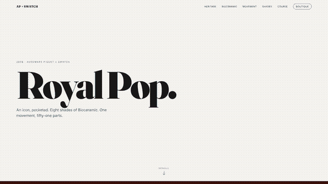

# Royal Pop — Scroll-Driven Product Landing Page

A premium scroll-driven landing page for the **Audemars Piguet × Swatch Royal Pop** Bioceramic pocket watch, built with vanilla HTML/CSS/JS, GSAP ScrollTrigger, and Lenis smooth scroll.

This README walks through how to build the same kind of site for any product you have a short video of.

<p align="center">
  
</p>

> **Note (course copy):** the source video and the 20-second demo clip are not included here to keep the repo small — grab them from [the original repo](https://github.com/hamzafarooq/claude-code-starter/tree/main/demos/royal-pop-website) or drop in your own.
>
> The source video (in `video/`) is what gets extracted into ~240 scroll-bound frames. Drop in your own video and Claude scaffolds the entire site from the `video-to-website` skill.

---

## What you're building

A single-page site where the **video plays frame-by-frame as the user scrolls**. Text sections fade in and out at specific scroll positions, animated counters, a horizontal marquee, and a persistent call-to-action at the end.

Stack: vanilla HTML/CSS/JS · GSAP 3 · ScrollTrigger · Lenis · FFmpeg for frame extraction. No bundler, no React.

---

## Prerequisites

| Tool | Why | Install |
|---|---|---|
| `ffmpeg` | Extract video → image frames | `brew install ffmpeg` (macOS) · `apt install ffmpeg` (Linux) · ffmpeg.org (Windows) |
| Python 3 **or** Node | Serve the site locally (any static server works) | Both ship pre-installed on most machines |
| Claude Code | The agent that drives the build | claude.ai/code |
| A product video | 10–30s, clean turntable / hero shot | See "Step 0" below |

---

## Step 0 — Generate the product video

You need a short video (10–30s, ideally on a clean cream or white background) of the product rotating or being explored. Render or shoot at 1080p+ to give the frame extractor good source material.

**Prompt to use with your video model of choice (Veo / Sora / Runway / Kling):**

> A seamless luxury product transformation animation on a **pure white infinite studio background** from beginning to end.
> Use the **first reference image** as the exact opening frame and the **second reference image** as the exact ending frame.
>
> The animation starts with a single monochromatic navy-blue octagonal luxury watch suspended in center frame against a completely clean white background. The watch is isolated with no environment.
>
> As the camera slowly moves forward, the watch begins an elegant exploded-view expansion. The bezel separates, screws float outward, sapphire crystal lifts away, dial layers unfold, and the internal movement components expand in perfectly choreographed engineering motion.
>
> Every component — gears, springs, bridges, crown, hands, indices, internal plates, and mechanical structures — floats outward in zero gravity while smoothly transitioning colors and materials from the dark navy/orange palette into the playful pastel palette of the final frame: yellow bezel, pink case, teal dial, black screws.
>
> The pieces rotate slowly and precisely like a luxury watchmaking presentation combined with a modern collectible toy commercial.
>
> The exploded parts then reassemble into the vibrant final composition from the second reference image, including the colorful dual-watch arrangement and visible movement details.
>
> **Visual style:** pure white seamless background throughout · no shadows · no reflections · no floor · no horizon line · floating isolated object only · ultra-clean CGI · centered composition · luxury industrial design animation · photorealistic materials with subtle stylized finish · smooth macro cinematography · highly detailed watch internals · crisp edges · soft ambient studio lighting · minimal aesthetic · Apple-style product reveal · high-end motion design · 8K render quality
>
> **Motion style:** slow elegant pacing · precise mechanical choreography · satisfying exploded-view engineering motion · calm cinematic camera movement · smooth reassembly into final colorful configuration
>
> **Negative prompt:** shadow, reflection, floor reflection, table, hands, wrist, human, dust, smoke, particles, text, watermark, clutter, dark background, environment, hard shadows, noisy render, low detail, warped geometry, extra watches, asymmetry, motion artifacts

Reference image 1 = monochromatic opening (e.g. `images/black.png` for Royal Pop). Reference image 2 = final colorful frame (e.g. `images/yello.png`).

A few quick rules for the video:
- **Background:** flat cream `#f5f3f0` or pure white. Coloured backgrounds force the site into "dark vignette over text" mode.
- **Length:** 12–18 seconds is the sweet spot — long enough for choreography, short enough to extract under 300 frames.
- **Motion:** continuous slow rotation or push-in. Avoid hard cuts; the scroll bind is one continuous timeline.
- **Aspect ratio:** 16:9 (1280×720 or 1920×1080).

Drop the finished video into `video/your-file.mp4`.

---

## Step 1 — Drop in the skill

Claude Code has a skill called `video-to-website` that knows the choreography rules (Lenis smooth scroll, frame-by-frame canvas binding, four+ different entrance animations, persistent CTA, etc.).

Place the skill file at:

```
.claude/skills/video-to-website.md
```

This repo ships with one — copy it to any new project.

---

## Step 2 — Brief Claude Code

Open this folder in Claude Code (`claude` in the terminal, or VS Code extension) and ask something like:

> "I dropped a video at `video/your-file.mp4`. Help me use the `video-to-website` skill to build a landing page for the product. Use web search to identify what the product is, write a resumable plan to `.claude/PLAN.md` so we can restart from there, then build it."

Claude will:
1. Look at the video and any reference images you've dropped in
2. Web-search to identify the product and pull marketing copy / facts
3. Write a `.claude/PLAN.md` with the section map, copy bank, and a checkbox build list
4. Wait for your "yes" before doing the build

---

## Step 3 — Build phase

After you approve the plan, Claude runs through:

```bash
# Extract ~240 frames from the video
ffmpeg -i video/your-file.mp4 -vf "fps=16,scale=1280:-1" -q:v 4 "frames/frame_%04d.jpg"
```

Then scaffolds three files:

```
index.html        ← loader, header, hero, canvas, marquee, scroll container with sections
css/style.css     ← variables, side-aligned zones, vignettes, mobile breakpoint
js/app.js         ← Lenis init, frame preloader, canvas renderer, GSAP timelines
```

---

## Step 4 — Serve locally

```bash
# Python
python -m http.server 8787

# Or via a specific conda env
/path/to/conda-env/bin/python -m http.server 8787

# Or Node
npx serve .
```

Open **http://localhost:8787** and scroll. You should see:
- Loader → fade out
- Hero (cream bg) → circle-wipe into the canvas
- 5–6 text sections fading in and out at their scroll windows, each with a different animation
- An oversized "BRAND" marquee scrubbing through the middle
- A stats section with a dark overlay and counters animating from 0
- A persistent CTA at the end

---

## Step 5 — Iterate

The plan is a contract — when something's off, tell Claude exactly what you see and it'll edit the right file. Common iterations from this build:

| Issue | Where the fix lives |
|---|---|
| Text not visible while scrolling | `.scroll-section` must be `position: fixed` (not absolute), opacity-driven |
| Dark text disappears over colourful frames | Add directional vignette + flip text to cream |
| Marquee invisible against dark bg | `mix-blend-mode: difference` on `.marquee-text` |
| Page bg edge doesn't match canvas frame | Sample frame edge color in `drawFrame()` and write to `document.body.style.backgroundColor` |
| Button stacking on top of next element | Convert `.cta-inner` to `display: flex; flex-direction: column; gap: 24px` — never trust block margins for critical layout |

All seven of these came up in *this* build. Expect them on yours too.

---

## File map

```
.
├── .claude/
│   ├── PLAN.md                       ← resumable build plan written by Claude
│   └── skills/video-to-website.md    ← the skill that defines the choreography rules
├── video/
│   └── <your-source-video>.mp4
├── frames/
│   └── frame_0001.jpg … frame_NNNN.jpg
├── images/                           ← optional reference photos for content blocks
├── index.html
├── css/style.css
├── js/app.js
└── README.md                         ← this file
```

---

## Tuning knobs (in `js/app.js`)

| Constant | What it does | Sweet spot |
|---|---|---|
| `FRAME_COUNT` | Total frames extracted | 150–300 |
| `FRAME_SPEED` | How fast product animation completes vs scroll | 1.8 – 2.2 |
| `IMAGE_SCALE` | Padding around the product on canvas | 0.82 – 0.90 |

And in `index.html`, each section has `data-enter` / `data-leave` (percent of total scroll) and `data-animation` (one of `fade-up`, `slide-left`, `slide-right`, `scale-up`, `rotate-in`, `stagger-up`, `clip-reveal`). Never use the same animation type for two consecutive sections.

---

## Credits

- Skill credit: [lobehub.com/skills/remamare13-claude-framework-video-to-website](https://lobehub.com/skills/remamare13-claude-framework-video-to-website)
- Product: [Audemars Piguet × Swatch Royal Pop](https://www.swatch.com/en-us/royal-pop.html)
